# MS2: Ash Tree Estates.

[View the live project here.](https://adamdelancey.github.io/ms2-ashtreeestates/)

As my submission for the Code Institute Milestone Project 2, this Ash Tree Estates website is based on a family student letting business
that is looking to expand its audience and get more views and enquiries from the student market, as well as book viewings and have access to useful documents for the tenancy.
It is designed to be responsive and accessible on a range of devices, making it interactive and easy to navigate for potential users.

    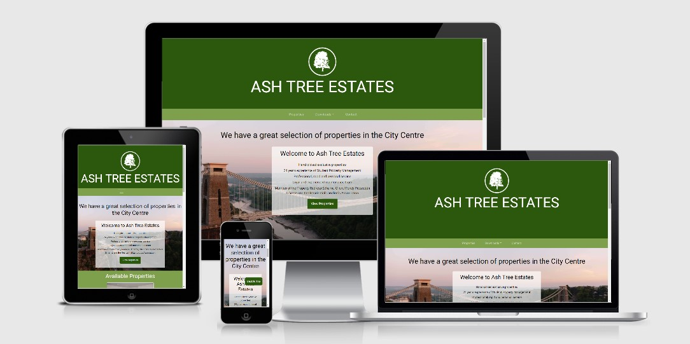

# Access

View the project live: [here](https://adamdelancey.github.io/ms2-ashtreeestates/)

View the Github repo: [here](https://github.com/adamdelancey/ms2-ashtreeestates)

## Contents

- [UX](#ux)
    - [Strategy](#strategy)
        - [Business Objectives](#business-objectives)
        - [User Stories](#user-stories)
            - [First Time Visitor Goals](#first-time-visitor-goals)
            - [Frequent User  Goals](#frequent-user-goals)
    - [Scope](#scope)
        - [Current Features](#current-features)
            - [Navbar](#navbar)
            - [Back to top Button](#back-to-top-button)
            - [Home Page](#home-page)
            - [Property Landing Page](#property-landing-page)
            - [Property Listing Page](#property-listing-page)
            - [Contact Page](#contact-page)
        - [Long-term goals](#long-term-goals)
    - [Structure](#structure)
    - [Skeleton](#skeleton)
        - [Wireframes](#wireframes)
    - [Surface](#surface)
        - [Design](#design)
            - [Colour Scheme](#colour-scheme)
            - [Typography](#typography)
            - [Imagery](#imagery)
            - [Icons](#icons)
- [Accessibility](#accessibility)
    - [Alt Tags](#alt-tags)
    - [Forms](#forms)
- [Technologies used](#technologies-used)
    - [Languages Used](#languages-used)
    - [Frameworks, Libraries & Programs Used](#frameworks-libraries-&-programs-used)
- [Testing](#testing)
    - [Validation](#validation)
    - [Autoprefixer CSS Online](#autoprefixer-css-online)
    - [Lighthouse](#lighthouse)
    - [EmailJS API](#emailjs-api)
    - [Testing User Stories from User Experience Section](#testing-user-stories-from-user-experience-section)
    - [Fixed Bugs](#fixed-bugs)
    - [Known Outstanding Bugs](#known-outstanding-bugs)
    - [Further Testing](#further-testing)
- [Deployment](#deployment)
- [Credits](#credits)
- [Acknowledgements](#acknowledgements)

# UX

## Strategy

### Business Objectives

1. To increase the number of direct enquiries through the website.
2. To improve the amount of information on the [current website](https://ashtreeestates.com/), in particular by adding a map feature.
3. To provide up-to-date information on the properties and documentation required.
4. To encourage students to get in touch, book a viewing and ultimately pay a deposit.

### User stories

-   #### First Time Visitor Goals

    As a First Time Visitor, I want to:

    1. Quickly understand the service offered by Ash Tree Estates and have a positive experience while browsing the website.
    2. Easily navigate through the website and find any properties that may interest me.
    3. View all of the properties that Ash Tree Estates have to offer, and the basic details about each one such as the number of bedrooms, bathrooms, area and price.
    4. Be able to filter the properties by the number of bedrooms and area to find the ones that I would be interested in looking at.
    5. Find relative information and pictures regarding each property in order to make an informed decision about whether or not to arrange a viewing.
    6. If interested, book a viewing and know that the request has been processed throughout the site.
    7. Easily find the relevant contact information to get in touch with Ash Tree Estates.
    8. Get the impression that Ash Tree Estates is a professional, reliable and efficient company.

-   #### Frequent User Goals

    As a Frequent User, I want to:
    1. Continue to explore properties and check which ones are available.
    2. Download the documents needed to complete my tenancy agreement and pay my deposit.
    3. Check to see if any properties have been recently added to the site.

## Scope

### Current features

* Navbar 
    * As well as a large title header showing the logo and name, the navbar allows easy access to other areas on the website.
    Based on the UX best practice of having the most important features appear at the top-left, the first option is
    the properties, then the downloadable forms, then access to the contact page, which acts as a call to action. This is 
    featured on all pages.
    * Additionally, the navbar is 'sticky' meaning that it goes down the page as the user scrolls down. This is used across
    all devices and pages.

* Back to top button
    * To improve UX and functionality, there is a 'back to top' button that appears once the user has browsed
    300px down the page. Again, this is used on all devices and pages and allows the user to navigate through the website more quickly.

* Home Page
    * Upon loading the website, the company logo and name start at the centre of the screen with the 
    dark green background to immediately show the branding and leave an impression on the user to remember
    the name and logo. This transitions to its position within 2s leaving the user to explore at their will. 
    * A h1 heading with the areas that Ash Tree Estates offer looping to complete the sentence "we have a 
    great selection of properties in..." this shows a sense of professionalism and fun and quickly shows off
    the areas covered by the company.
    * The 3 properties that appear on the homepage were chosen by the founder of Ash Tree Estates, who currently wants to
    prioritise those properties. However, if the user wants to view more properties, there is an option to click the 'see
    more' button which shows all of the properties, then a 'see less' button to minimise this to the initial 3.
    * There is a contact form at the bottom with a 'submit' button which has a modal thanking the user for his/her
    enquiry. This again acts as a call to action for the user.

* Property Landing Page 
    * Upon loading the page, the user is immediately presented with the option to view all of the properties either
    as a list or on a map (loaded from the Google Maps API). This allows the user to browse based upon their preference of what 
    is important to them when choosing a property.
    * Additionally, there is an option to narrow the search by number of bedrooms. It is assumed that users accessing 
    the website will already know their group size, and so there is a quick way to filter the information that is 
    not relevant to them.
    * Each property shows its location, number of bedrooms and bathrooms, price, and the key selling points to give 
    the user a quick overview of the benefits of that property, and if interested, they have the option of clicking
    either the title or picture to find out more and view the relevant property listing page.

* Property Listing Page
    * In addition to the key selling points and price/property summary, the user is presented with a button to 
    arrange a viewing, which similarly they can fill in and a modal will appear thanking them for their interest 
    and saying that the company will get back to them. 
    * A carousel of images/videos showing off the properties. Some are fairly poor quality, but this is out of my control 
    as all videos/images have been supplied to me by the company.
    * An 'Explore the Area' section, which using Google Maps API's nearby search allows the user to explore local points 
    of interest including the restaurants, cafes, pubs and supermarkets. These factors can play a large role in 
    selecting whether or not a property is suitable, and therefore could potentially speed up the process from viewing a property 
    online to paying their deposit, particularly for international students who may not be able to view the property in person.

* Contact Page 
    * As above, here we list the various ways to contact Ash Tree Estates, including a 'submit enquiry' button.
    * In addition, professional photos of Bristol have been added to show off the city, as well as some important 
    information about Ash Tree Estates including some key selling points.

### Long-term goals

Future improvements to the website may include:

* More options to narrow down searches, such as a search box, and additional features like being able to browse by price.
* Improved imagery of the properties throughout the site.
* A payment system such as Stripe to take direct bookings and not just enquiries.

## Structure

* I made the decision to have the site split into four clear sections - Home, Properties, Downloads & Contact, 
with each page having the same navbar and footer details for consistency and ease of use.

* The Home page is one HTML page and is ordered structurally via importance of content, starting with a large
hero image with a 'view properties' button, a few highlighted properties with the option to see more, followed by 
a contact form. 

* The Properties page, the most important page of the site, acts as a landing site for which the user can then 
narrow down their searches and easily find a property that is appealing to them, with the option to then 
move onto the individual property listing. 

* The property listing pages, of which there are currently 11 to represent all of the company's properties, were 
purposely chosen to be on separate pages so that the user can find all of the information and photos relevant to that 
particular property in one place.

* The Downloads section was chosen to be simply a dropdown list from the navbar for ease of access, where the forms 
will download instantly in a separate tab, meaning that the user stays on the site while they receive the relevant 
document.

* The Contact page, likewise with the Home Page, is one HTML page ordered structurally via importance of content. 
In contrast to the wireframes, it was chosen for the information on what would have been the 'About' Page to be 
combined with the contact page.

## Skeleton

### Wireframes

Desktop View

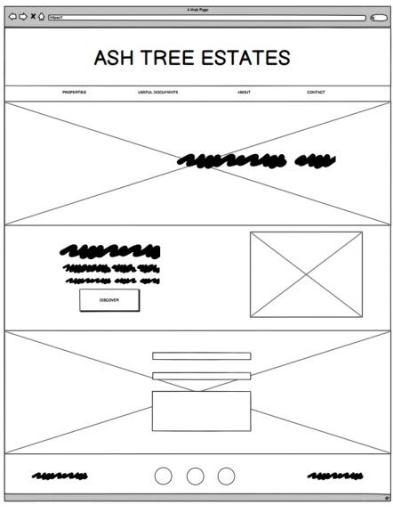
    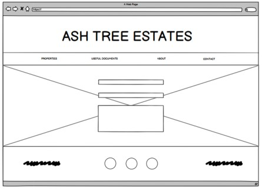    
    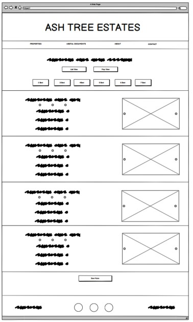
    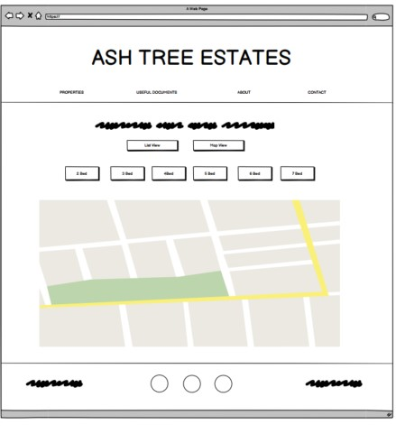
    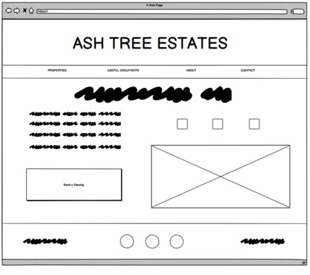

Mobile & Tablet Pages

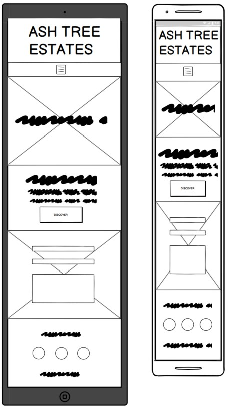
    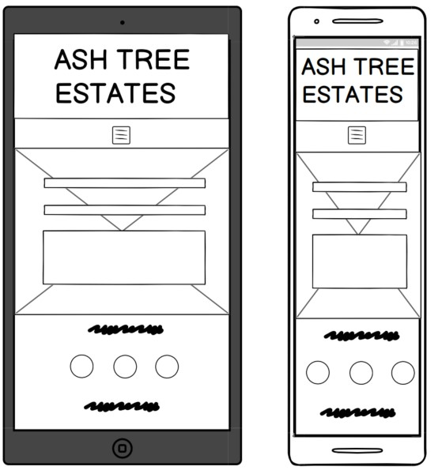    
    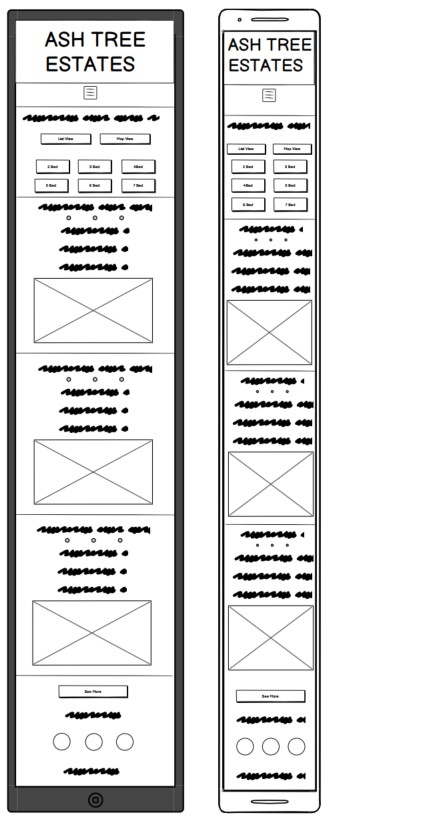
    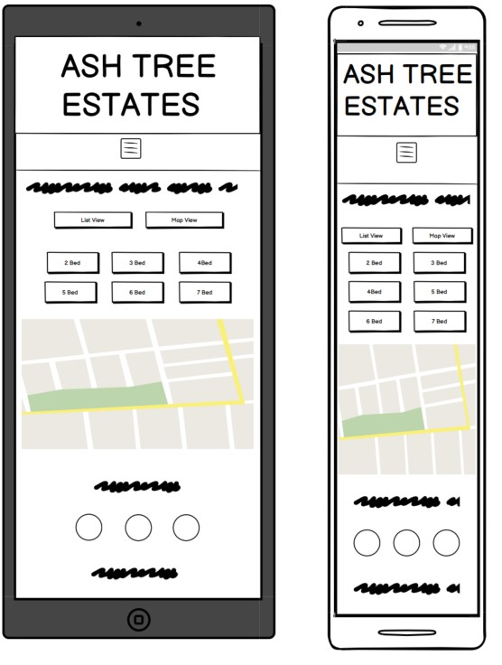
    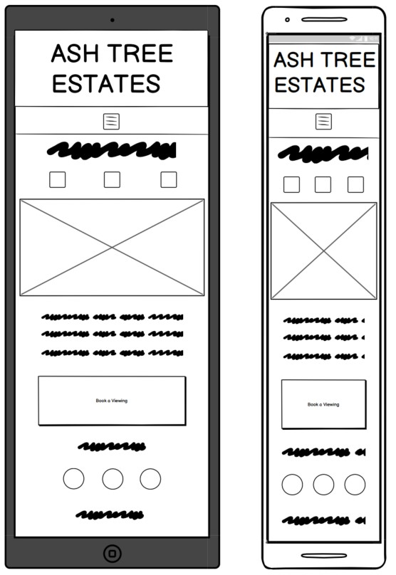

Full wireframes can be accessed here:

-   Desktop Wireframes - [View](documentation/wireframes/desktop-wireframes.pdf)

-   Mobile & Tablet Wireframes - [View](documentation/wireframes/tablet-and-mobile-wireframes.pdf)    

## Surface
   
### Design
-   #### Colour Scheme
    
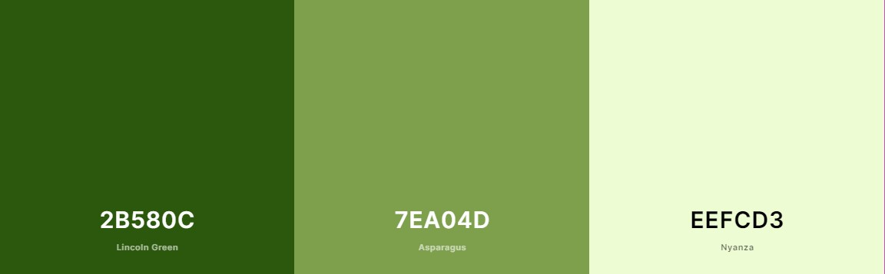

    -   The three main colours used are different shades of green, with the darkest green, #2b580c; used for the header, footer and buttons,
    a lighter green, #7ea04d, chosen as a secondary colour to be used for the navbar and other titles, and finally the lightest green,
    #eefcd3, which is used a background colour for any longer text elements or areas that include white. These were chosen from
    [Color Hunt](https://colorhunt.co/) after agreement with the founder of Ash Tree Estates, as a representation of the color of an ash tree, 
    with the lighter green colours complimenting the header and therefore appealing to the eye.

-   #### Typography
    -   The Roboto font is the main font used throughout the whole website with Sans Serif as the fallback font in case for any reason the 
    font isn't being imported into the site correctly. Roboto was chosen after agreement with the Ash Tree Estates founder.

-   #### Imagery
    -   The Home and Contact Pages will have a large hero image showcasing the city of Bristol, where the properties are located. These 
    professional photos were chosen to give a sense of professionalism to the user and therefore a positive experience.
    - Within each property listing the use can find the photos and videos that were supplied by Ash Tree Estates. The best images of 
    the properties were chosen in order to help sell the user and encourage them to book a viewing to find out more.     
    - All photos were put through [Tiny PNG](https://tinypng.com/) to reduce the file size and improve loading time.

-   #### Icons
    -   Contact icons used in the footer and contact page, as well as in the description for each property have been taken 
     from [Font Awesome](https://fontawesome.com/).

# Accessibility

## Alt Tags

In order to ensure that all images are accessible for those using a screen reader, I have ensured that all images used throughout the site include alt tags.

## Forms

The forms on the site used in the modals of "Contact Us" and "Enquire Now" have aria-labels so that screen readers can read out what is the required input in the necessary fields.

# Technologies used

## Languages Used

-   HTML5
-   CSS3
-   JavaScript

## Frameworks, Libraries & Programs Used

1. [Google Maps API](https://developers.google.com/maps/documentation/javascript/overview)
    - The Google Maps API was used on all pages related to the individual properties and the main property listing page. 
    This was the main API used throughout the site, and was used for both placing markers with information where the properties
    are located, as well as using the getNearbyPlaces function to show points of interest close to the properties.
1. [EmailJS](https://www.emailjs.com/)
    - EmailJS has been used for all forms across the site for receiving any enquiries or viewing requests from the user. A 
    template email was created in emailJS for the company to receive, but for testing purposes the email address currently used 
    is the developer's. This will be amended upon website release.
1. [JQuery](https://jquery.com/)
    - I have used JQuery for some JS functions, particularly ones that use event listeners such as for the see more/less buttons 
    on the homepage and the filtering of properties by number of bedrooms.
1. [Bootstrap 4.5.2:](https://getbootstrap.com/docs/4.4/getting-started/introduction/)
    - Bootstrap was used to assist with the responsiveness and styling of the website, such as the navbar, carousels and cards features.
1. [Google Fonts:](https://fonts.google.com/)
    - Google fonts were used to import the 'Roboto' font which is used on all pages throughout the project.
1. [Font Awesome:](https://fontawesome.com/)
    - Font Awesome was used on all pages throughout the website to add icons for aesthetic and UX purposes. 
1. [Git](https://git-scm.com/)
    - Git was used for version control by utilising the Gitpod terminal to commit to Git and Push to GitHub.
1. [GitHub:](https://github.com/)
    - GitHub is used to store the projects code after being pushed from Git.
1. [Balsamiq:](https://balsamiq.com/)
    - Balsamiq was used to create the wireframes during the design process.

# Testing

## Validation

The W3C Markup Validator and W3C CSS Validator Services were used to validate every page of the project to ensure there were no syntax errors in the project.

-   [W3C Markup Validator](https://validator.w3.org/) - [Results](https://validator.w3.org/nu/?doc=https%3A%2F%2Fadamdelancey.github.io%2Fms2-ashtreeestates%2Findex.html)
    This same result appears across every page of the site.
    
 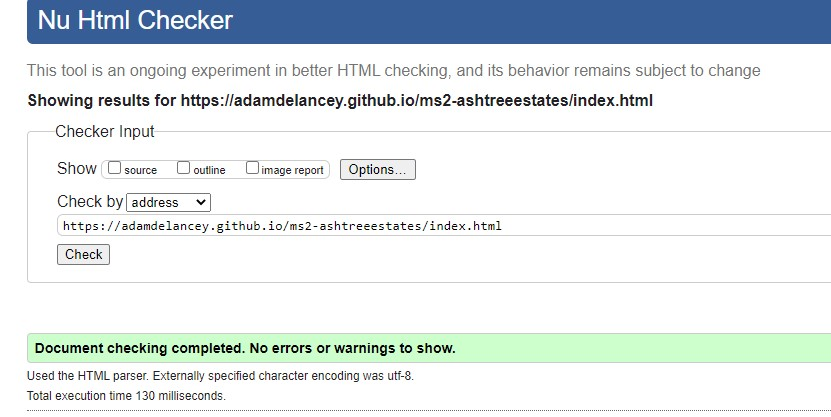  
 
-   [W3C CSS Validator](https://jigsaw.w3.org/css-validator/) - [Results](https://jigsaw.w3.org/css-validator/validator?uri=https%3A%2F%2Fadamdelancey.github.io%2Fms2-ashtreeestates%2Findex.html&profile=css3svg&usermedium=all&warning=1&vextwarning=&lang=en) -  
    There are 2 property issues found when checking the site. However, these are being validated from the Bootstrap CDN link and therefore out of my control.
    
 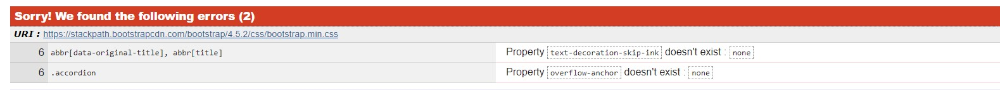  
 
-   [JSHint](https://jshint.com/) - 
    Each of the JS files has been validated using JSHint. The use of 'let' and 'const' has returned a large number of 
    warnings from the test. It has been used extensively for this website, but has been discussed with my tutor and 
    considered not to be an issue.

    
 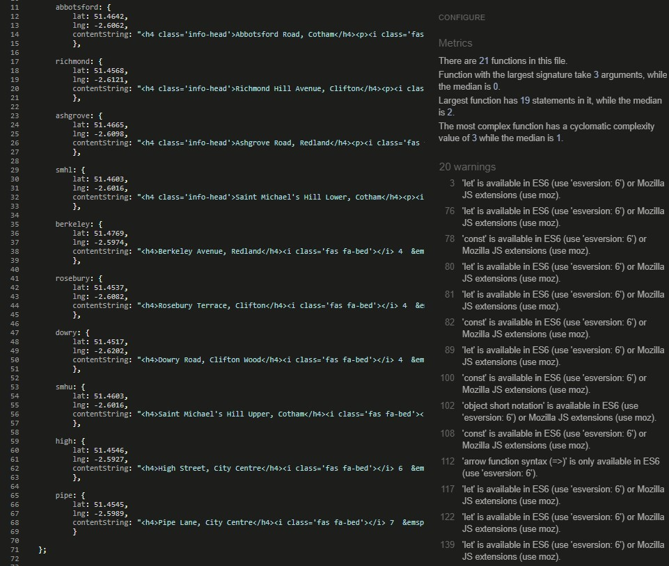  
 

## Autoprefixer CSS Online

This was used to parse CSS and add vendor prefixes in order to ensure that the CSS styling works properly across all 
browsers. I have added the below header to my CSS styles sheet in order to show this:

 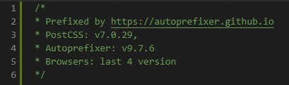  

## Lighthouse

Desktop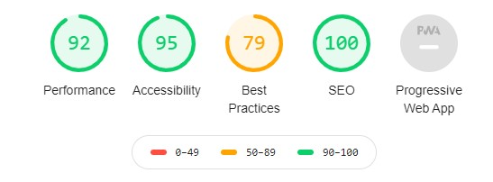
Mobile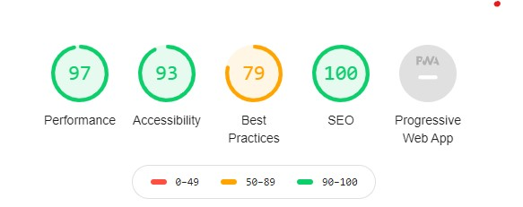

From Chrome Developer Tools, this Lighthouse score is based on the homepage while being viewed on desktop and mobile. I worked hard on
ensuring high scores across the site in particular by putting every image through [Tiny PNG](https://tinypng.com/), and improving 
SEO scores by adding a meta description to each page. The lower 'Best Practices' score is primarily due to the JavaScript
libraries being used for the site, specifically JQuery.

## EmailJS API

I have tested this manually on every page to ensure that the contact form is being sent through successfully. You can see this 
here:

 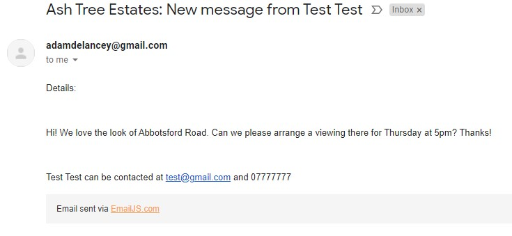  

## Testing User Stories from User Experience Section

-   #### First Time Visitor Goals - I want to:

    1. Quickly understand the service offered by Ash Tree Estates and have a positive experience while browsing the website.
        - *As the user first enters the homepage, they are greeted with the large animated logo and brand name to show that
        they have reached the correct site. Then, the first option to select is Properties, as well as a number of properties
        below to select. This creates a positive experience as the properties, forms and contact options are easy to find.*
    2. Easily navigate through the website and find any properties that may interest me.
        - *There is an identical navbar and footer on each page used to navigate throughout the site. There is then the option to 
        view all of the available properties on the homepage, as well as on the properties landing page.*
    3. View all of the properties that Ash Tree Estates have to offer, and the basic details about each one such as the number of 
    bedrooms, bathrooms, area and price.
        - *Each time a property is listed, including on the homepage, properties listing page map view and list view, I have added
        the key details of the address, price, and number of bathrooms and bedrooms, as pictured below. These basic pieces of 
        information can easily persuade a user whether or not to find out more about the property, and helps them to quickly 
        make decisions. I have used consistent and common icons throughout the site to show this information.*
        
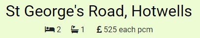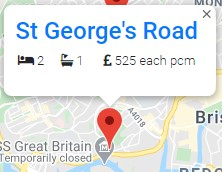

    4. Be able to filter the properties by the number of bedrooms and area to find the ones that I would be interested in looking at.
        - *On the properties landing page, the user is immediately given the option to select either the list view or map view
        as well as the number of bedrooms they want to see in their properties. This simple use of buttons allows easy user 
        interaction, with the chosen button then highlighted, and the relevant properties shown in either view. With both options, 
        the user can find a short summary of the property and then click through to the relevant listing page.*
       
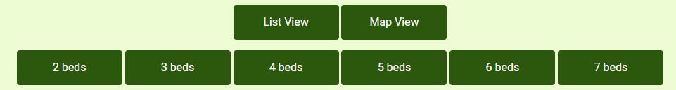

    5. Find relative information and pictures regarding each property in order to make an informed decision about whether or not to arrange a viewing.
        - *Each property listing page includes the property's key features and selling points, as well as number of pictures 
        or videos showcasing the property. These features clearly highlight why the property may be appealing to them, then 
        if they are interested, there is an easy to find 'Book Viewing' button for them to click on.*
    6. If interested, book a viewing and know that the request has been processed throughout the site.
        - *The aforementioned 'Book Viewing' button on the property listing page acts as a call to action allowing the user 
        to make an appointment if they are interested. Once they click on the button, they are first presented with a form option,
        followed by a second modal showing that the enquiry has been received.*
        
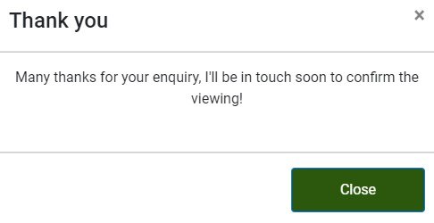

    7. Easily find the relevant contact information to get in touch with Ash Tree Estates.
        - *As well as the contact page showing three different options for getting in touch with the company, the key details 
        are also listed in the footer of each page, and the homepage and property listing pages also include forms that can be 
        submitted if the user would prefer this option.*
        
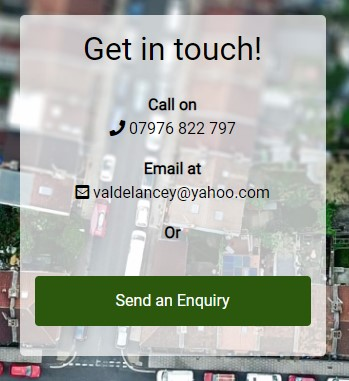

    8. Get the impression that Ash Tree Estates is a professional, reliable and efficient company.
        - *To give this information, I have included a range of features to show this. Firstly, within the Downloads 
        section the user has the option to view the company's Money Protection Certificate, as well as a range of other professional 
        documents. Secondly, within the contact page, I have included a number of reasons of why to choose Ash Tree Estates, 
        both used as a selling tool and also to show a sense of professionalism. Thirdly, the layout, imagery and styles across the 
        site I believe furthers this feeling. Finally, by including a number of contact options and the above modal promising the user 
        that they will soon hear back from the company, shows a sense of urgency and company quality.*
    

-   #### Frequent User Goals - I want to:
    1. Continue to explore properties and check which ones are available.
        - *With multiple ways of finding the properties, it is easy for the user to explore the properties at their will. 
        In addition, once certain properties have been let, I can add a note to reflect this, allowing the user to quickly find out 
        whether or not the property is still available.*
    2. Download the documents needed to complete my tenancy agreement and pay my deposit.
        - *I have included a very simple dropdown list where all important documents can be downloaded in a different tab. This means 
        that the user will stay on the site, and easily be able to find the documents needed to complete the tenancy. This ensures a smooth
        process of completing any agreements and ultimately paying a deposit.*
        
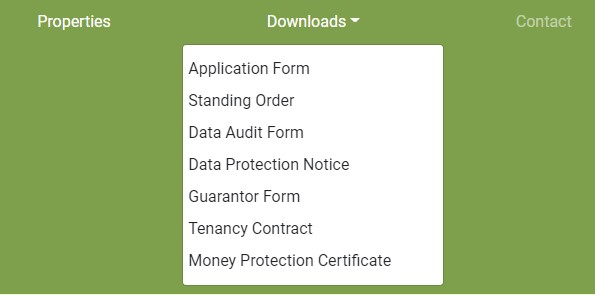

    3. Check to see if any properties have been recently added to the site.
      - *Similarly to point 1, with multiple ways of finding and filtering the properties, it will be very straightforward 
      for a user to check whether or not any new properties have been added to the list.*

## Fixed Bugs
After deployment, I found multiple bugs that needed addressing:

 1. Google Maps markers from getNearbyPlaces search overlapping each other
    - *The first step was to create a clearFilters() function, which would set the setMaponAll function to a null value. However,
    this initially had no effect as the markers created by the getNearbyPlaces function was individually listing all of the values. 
    Therefore, I created an empty markers array, followed by using the .push method to push all of the markers created by 
    the getNearbyPlaces into an array. The clearFilters() function then had the desired effect, and I added these to the click 
    event listeners in order to clear the map before loading the next array of markers.*
2. The 'sticky' navbar was hiding behind the content when scrolling down the page.
    - *In order to fix this, I added a z-index of 900 to the 'sticky' class so that the whole navbar was visible over the content at all times*
3. The dropdown 'Downloads' from the navbar was still hiding behind the content. 
    - *I thought that this was initially also related to the z-index, but changing the value seemed to have no effect. 
    By using Google Developer Tools, I noticed that the position: absolute was affecting this. I therefore changed the value 
    to position: unset, and then it became clear.*
4. The changeText() function on the homepage that shows the various areas where the company has properties, would always 
end the loop on 'undefined.'
    - *I amended the function to read currentProperty < areas.length -1 rather than simply currentProperty < areas.length, which removed 
    the undefined property and had the desired effect.*
5. The 'Back to Top' button worked, but was hiding the information in the footer once it reached the bottom of the page.
    - *To fix this, I simply had to increase the padding-bottom value to ensure that it no longer covered the footer, and 
    amended the media queries to ensure this had the desired effect on all devices.*
6. The EmailJS functions were not working properly across all pages.
    - *Rearranged the order of the script tags to that this code ran first.*

## Known Outstanding Bugs

1. The navbar dropdown item 'Downloads' moves to the right when clicked on all devices.
    - *I have looked into many possible reasons for this using Dev Tools, but can't seem to fix it!*
2. On the homepage, the 'sticky' navbar does not start until you have scrolled past 100% of the screen on initial load.
    - *This appears to be due to the @keyframes animation when the page initially loads, as when I removed this transition, 
    the sticky navbar works as it does across the remainder of the site. I am not sure why this transition affects the 
    JavaScript function, but I have chosen to keep it as it is as I like the opening transition.*

 
## Further Testing

- Throughout the development process, I used the Chrome Developer Tools, specifically for using the console.log function to test 
JavaScript code and also for the various CSS designs, particularly around responsiveness. On especially narrow devices < 300px, some images were 
larger than the width, however I felt this had no effect on UX.
- The website has been tested on various desktop browsers such as Google Chrome, Firefox, Safari and Edge, as mentioned above, I used 
the CSS tool Autoprefixer Online to help with this. 
- Each link has been tested across the site to ensure everything was linked correctly.
- Friends and family were also asked for advice particularly on layout and in order to ensure that the site was being tested across 
various devices. 

# Deployment

The site was published in GitPages using the following steps:
1. First, all code was written on the IDE Gitpod and was then pushed to GitHub using the 'git push' entry in the terminal, where it is now stored in [my repository](https://github.com/adamdelancey/ms2-ashtreeestates).
2. To push the site live, under the Settings section of the repository I selected, I scrolled down to where it says 'GitHub Pages'.
3. I then selected 'Master Branch' under Source and then the page automatically refreshed.
4. This created the URL which can be viewed [here](https://adamdelancey.github.io/ms2-ashtreeestates/index.html).
5. The site was then found by scrolling back to the "GitHub Pages" section where you can see the following:

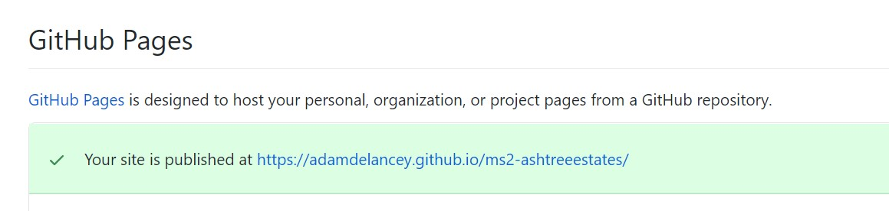

To access the code, it can be run locally through a download or cloned.

Initially, I used "git commit" and "git push" for every major change, then at later stages used these functions when de-bugging or making minor editing changes to ensure the live version was the most recent version, as well as to avoid losing any work.

# Credits

- All professional images have been sourced from a combination of [Unsplash](https://unsplash.com/s/photos/bristol) and [Pixabay](https://pixabay.com/).
- All photos related to the properties have been sourced from Ash Tree Estates.
- The Navbar, Forms, Carousels and Cards have been chosen from Bootstrap templates and adapted using CSS.
- Initial instructions for setting up the Google Maps API were taken from the relevant lesson from the [Code Institute](https://codeinstitute.net/).
- Similarly, setting up the EmailJS API was also taken from the relevant lesson from the [Code Institute](https://codeinstitute.net/).
- Instructions for setting up the getNearbyPlaces function was taken from the [Google Codelabs Developer lessons](https://codelabs.developers.google.com/codelabs/google-maps-nearby-search-js#1)
- [Stack Overflow](https://stackoverflow.com/) and [W3C Schools](https://www.w3schools.com/) were used for occasional debugging or issues where I could not initially work out the solution myself.
- Fonts are from [Google Fonts](https://fonts.google.com/) and icons from [Font Awesome](https://fontawesome.com/).

# Acknowledgements

- My mentor, Anthony Ngene, for his impressive patience and hugely appreciated help throughout the project.
- The peer-code-review channel on Slack and their trusty channel leads for both code and design tips.
- Friends and family for testing the site on their various devices.
